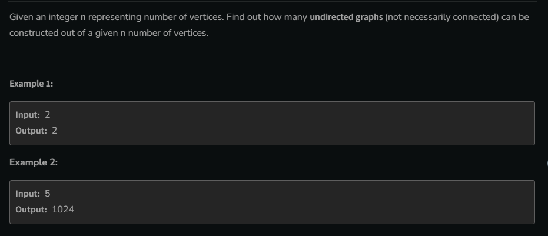
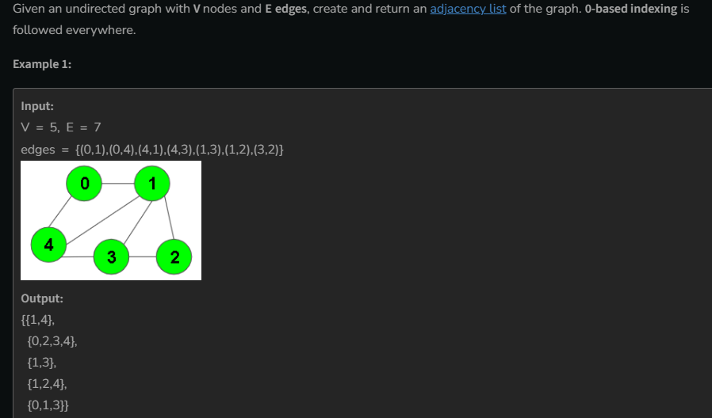
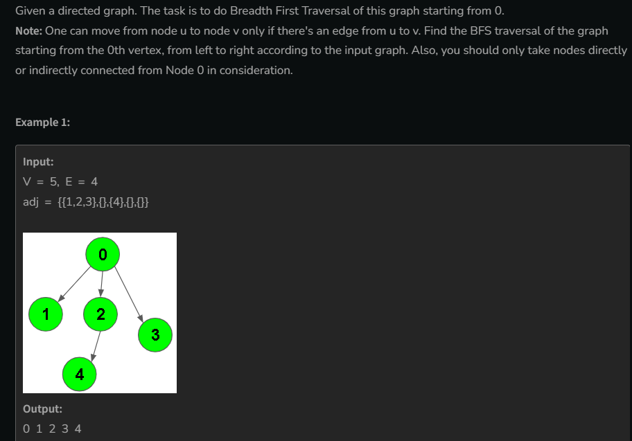
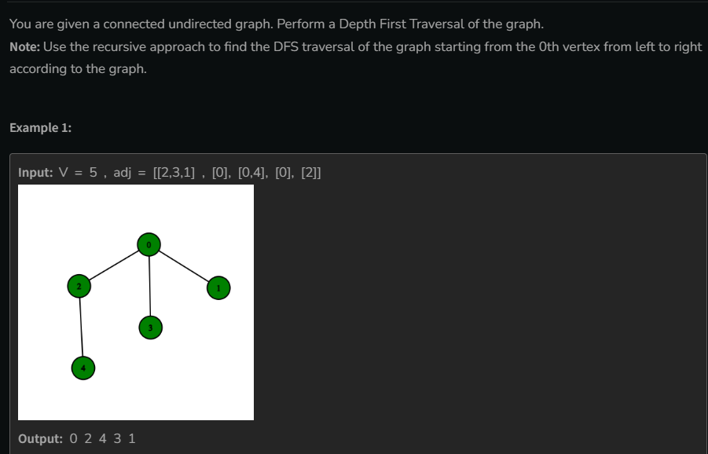

# 01. Number of Total Possible Graph


```cpp
long long Solve(int n ){
    long long ans;
    ans = pow(2,n*(n-1)/2);
    return ans;
}
```

# 02. Print AdjList



- Represention of Graph in AdjList form

```cpp

vector<vector<int>> Solve(vectro<pair<int,int>>edge , int V){
    // make a 2D vector of size v
    //  vector<vector<int>>adjList(V, vector<int>(0));

     vector<vector<int>>adjList(V);
    
    for(int i =0;i<edge.size();i++){
        int v = edge[i].first;
        int u = edge[i].second;
        // it's is a undirected graph
        adjList[v].push_back(u);
        adjList[u].push_back(v);
    }

  
    return adjList;
}

```
# BFS of a graph



**BFS** uses queue Data Structre
```cpp
vector<int>BFS(vector<int> adj[] , int V){
    // starting from point 0
    // make a queue
     queue<int>q;
    q.push(0);
    // make a visted array for check isViseted or not
    vector<bool>visited(V,0);
    visited[0] = 1;
    vector<int>ans;

    while(!q.empty()){
        int parent = q.front();
        // remove the Parent from the queue
         q.pop();
        ans.push_back(parent);
        
       // traverse all the child of this parent
        for(int child =0;child<adj[parent].size();child++){
          if(!visited[adj[parent][child]])
          {
            q.push(adj[parent][child]);
           visited[adj[parent][child]] = 1;
          }
        }
    }

return ans;
}

```
# DFS 


## recursion code
```cpp
// function for dfs
void dfs(int node , vector<int>&ans , vector<bool>&visited , vector<int>&adj[]){
    // make visited to node
    visited[node] = true;
    // store in ans
    ans.push_back(node);
    // visit all unvisted naebhour of node
    for(int child = 0;child<adj[node].size();child++){
        if(!visited[adj[node][child]])
        dfs(adj[node][child],ans,visited, adj);
    }
}

vector<int> dfsOfGraph(int V, vector<int> adj[]) {
        // make a visited vector
        vector<bool>visited(V,0);
        vector<int>ans;
        solve(0, ans,visited, adj);
        return ans;
        
    }

```
## Stack code  // important
```cpp
vector<int>dfsOfGraph(int V , vector<int>adj[]){
    vector<bool>vis(V,0);
    stack<int>st;
    vector<int>ans;
    st.push(0);
    while(!st.empty()){
        int node = st.top;
        st.pop();
        if(!vis[node]){
            vis[node]=1;
            ans.push_back(node);
            // graph reaf left to right in ans 
            // note ans can be diff
            for(int i = adj[node].size();i>=0;i--)
            st.push(adj[node][i]);
        }
    }
return ans;
}
```


